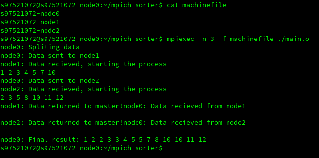
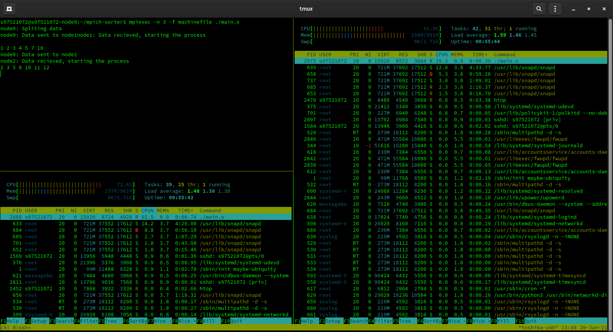

# mpich-sorter

In this program we use three machines for sorting an array.
First the master node splits the array into 2 parts and sends each to a machine. Each machine starts its job and sorts that subset of the initial array. Finally it returns the result and the master node merges them.  

I have used **insertion sort** for simplicity.

The result looks like this:   



## Check other systems too!!
In order to make sure that this program is running on all of the machines I added a long **for** statemenet to check the process on the other machines.
```c
for (long i=0; i < 10000000000; i++);
```
The above code placed inside node section and using **htop** the process is visible.  
As you can see, three different nodes are shown in the picture and the first process in **node1** and **node2** is the **./main.o** file.


